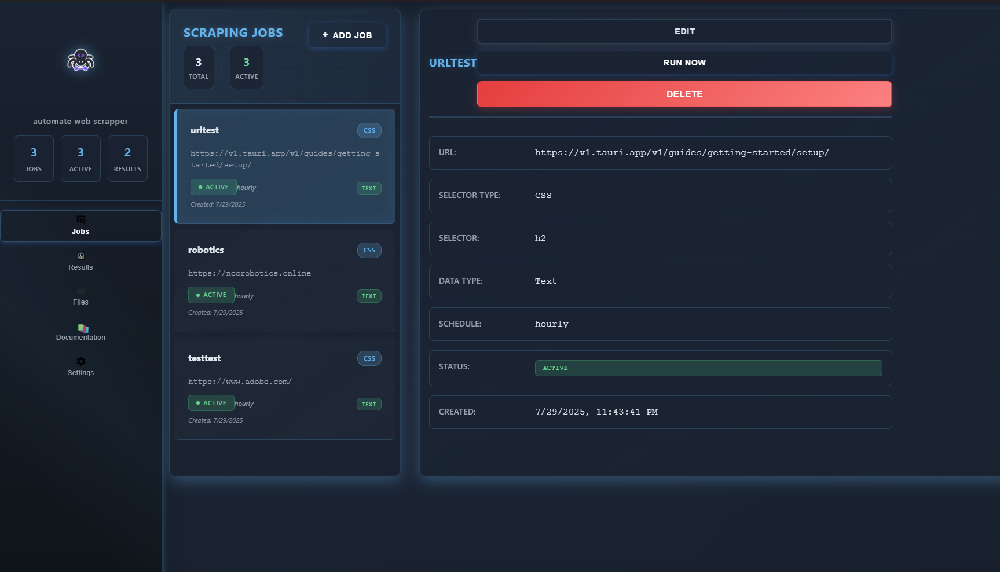

# 🕷️ Automated Web Scraper

<div align="center">
  
  <h3>A powerful cross-platform desktop application for automated web scraping</h3>
  <p>Built with Rust, Tauri, React, and SQLite3</p>
  
  [](https://www.rust-lang.org/)
  [](https://www.typescriptlang.org/)
  [](https://reactjs.org/)
  [](https://tauri.app/)
  [](https://www.sqlite.org/)
</div>

## 🎥 Demo Video

<div align="center">
  <video width="800" controls>
    <source src="automate_web_scrape - Made with Clipchamp.mp4" type="video/mp4">
    Your browser does not support the video tag.
  </video>
  <p><em>Watch the application in action - demonstrating job creation, scheduling, and data export features</em></p>
</div>

> **Note**: If the video doesn't play in your markdown viewer, you can find it in the project root as `automate_web_scrape - Made with Clipchamp.mp4`

## 📸 Screenshots

<div align="center">
  
  <p><em>Clean and intuitive user interface</em></p>
</div>

## 📋 Table of Contents

- [🎥 Demo Video](#-demo-video)
- [📸 Screenshots](#-screenshots)
- [🚀 Features](#-features)
- [🛠️ Tech Stack](#️-tech-stack)
- [📋 Prerequisites](#-prerequisites)
- [🔧 Installation & Setup](#-installation--setup)
- [🏗️ Building for Production](#️-building-for-production)
- [📖 Usage Guide](#-usage-guide)
- [🔧 Configuration](#-configuration)
- [🐛 Troubleshooting](#-troubleshooting)
- [🔒 Security Considerations](#-security-considerations)
- [🤝 Contributing](#-contributing)
- [📄 License](#-license)
- [🙏 Acknowledgments](#-acknowledgments)
- [📞 Support](#-support)

## ⚡ Quick Start

```bash
# Clone the repository
git clone <repository-url>
cd automated_web_scraper

# Install dependencies
npm install

# Run in development mode
npm run tauri dev
```

## 🚀 Features

<div align="center">

| Feature | Description |
|---------|-------------|
| 🎯 **Job Management** | Create, edit, delete, and manage web scraping jobs with intuitive UI |
| 🔍 **Flexible Selectors** | Support for CSS selectors and regex patterns for precise data extraction |
| ⏰ **Smart Scheduler** | Background execution using cron expressions (daily, weekly, monthly, custom) |
| 💾 **Data Storage** | SQLite database for persistent storage of jobs and results |
| 📤 **Export Options** | Export results as CSV, JSON, or HTML formats |
| 📧 **Email Integration** | SMTP configuration for sending exports via email automatically |
| 🌐 **Proxy Support** | Optional proxy URL configuration per job for enhanced privacy |
| 🤖 **Custom User Agents** | Configurable user agents for web requests to avoid detection |
| ⚡ **Real-time Results** | View scraped data with timestamps and status updates |
| 🖥️ **Cross-platform** | Native performance on Windows and Linux systems |

</div>

## 🛠️ Tech Stack

<div align="center">

### Backend
| Technology | Purpose |
|------------|----------|
| 🦀 **Rust** | Core backend language with Tokio async runtime |
| 🗄️ **SQLite3** | Database via rusqlite for data persistence |
| 🌐 **reqwest** | HTTP client for web requests |
| 🔍 **scraper** | HTML parsing and CSS selector engine |
| ⏰ **tokio-cron-scheduler** | Job scheduling and automation |
| 📧 **lettre** | SMTP client for email functionality |

### Frontend
| Technology | Purpose |
|------------|----------|
| ⚛️ **React** | UI framework with TypeScript |
| 🎨 **CSS3** | Styling and responsive design |
| 🖥️ **Tauri** | Desktop app framework and native APIs |
| ⚡ **Vite** | Build tool and development server |

</div>

## 🎯 Use Cases

- **📊 Market Research**: Monitor competitor prices, product availability
- **📰 News Monitoring**: Track news articles, press releases, blog posts
- **🏠 Real Estate**: Monitor property listings, price changes
- **💼 Job Hunting**: Track job postings across multiple platforms
- **📈 Stock Market**: Monitor financial data, stock prices
- **🛒 E-commerce**: Track product reviews, ratings, inventory
- **📱 Social Media**: Monitor mentions, hashtags, trends
- **🔬 Research**: Collect data for academic or business research

## 📋 Prerequisites

### System Requirements
- **Windows**: Windows 10 or later
- **Linux**: Ubuntu 18.04+ or equivalent
- **Memory**: 4GB RAM minimum
- **Storage**: 100MB free space

### Development Requirements
- **Rust**: 1.70.0 or later
- **Node.js**: 16.0.0 or later
- **npm**: 8.0.0 or later

## 🔧 Installation & Setup

### 1. Clone the Repository
```bash
git clone <repository-url>
cd automated_web_scraper
```

### 2. Install Rust Dependencies
```bash
# Install Rust if not already installed
curl --proto '=https' --tlsv1.2 -sSf https://sh.rustup.rs | sh
source ~/.cargo/env

# Install Tauri CLI
cargo install tauri-cli
```

### 3. Install Node.js Dependencies
```bash
npm install
```

### 4. Development Setup
```bash
# Start development server
npm run tauri dev
```

The application will open in a new window with hot-reload enabled for both frontend and backend changes.

## 🏗️ Building for Production

### Windows Build
```bash
# Build for Windows
npm run tauri build
```

The executable will be created in `src-tauri/target/release/bundle/msi/`

### Linux Build
```bash
# Install additional dependencies for Linux
sudo apt update
sudo apt install -y libwebkit2gtk-4.0-dev build-essential curl wget libssl-dev libgtk-3-dev libayatana-appindicator3-dev librsvg2-dev

# Build for Linux
npm run tauri build
```

The AppImage will be created in `src-tauri/target/release/bundle/appimage/`

### Cross-compilation
For cross-platform builds, you can use GitHub Actions or Docker containers with the appropriate toolchains.

## 📖 Usage Guide

### Getting Started

1. **Launch the Application**
   - Run the executable or use `npm run tauri dev` for development
   - The app will initialize the database and create necessary directories

2. **Create Your First Scraping Job**
   - Click "Add Job" in the Jobs tab
   - Fill in the required fields:
     - **Job Name**: Descriptive name for your job
     - **Target URL**: The website URL to scrape
     - **Selector Type**: Choose CSS or Regex
     - **Selector/Pattern**: CSS selector (e.g., `.title`) or regex pattern
     - **Data Type**: Text content or HTML attribute
     - **Schedule**: How often to run the job

3. **Test Your Job**
   - Use the "Test" button to verify your selectors work correctly
   - Review the scraped data before saving

4. **Schedule and Run**
   - Save the job to enable automatic scheduling
   - Use "Run Now" for immediate execution
   - Check the Results tab to view scraped data

### Job Configuration Examples

#### Example 1: Scraping Article Titles
- **URL**: `https://news.ycombinator.com`
- **Selector Type**: CSS
- **Selector**: `.titleline > a`
- **Data Type**: Text
- **Schedule**: Daily

#### Example 2: Extracting Product Prices
- **URL**: `https://example-shop.com/product/123`
- **Selector Type**: CSS
- **Selector**: `.price`
- **Data Type**: Text
- **Schedule**: Hourly

#### Example 3: Using Regex for Email Extraction
- **URL**: `https://example.com/contact`
- **Selector Type**: Regex
- **Pattern**: `[a-zA-Z0-9._%+-]+@[a-zA-Z0-9.-]+\.[a-zA-Z]{2,}`
- **Data Type**: Text
- **Schedule**: Weekly

### Schedule Formats

- **Daily**: Runs once per day at midnight
- **Hourly**: Runs every hour
- **Weekly**: Runs once per week on Sunday
- **Monthly**: Runs on the first day of each month
- **Custom**: Use cron expressions (e.g., `0 9 * * 1-5` for weekdays at 9 AM)

### Export Options

1. **CSV Export**
   - Comma-separated values format
   - Compatible with Excel and Google Sheets

2. **JSON Export**
   - Structured data format
   - Ideal for API integration

3. **HTML Export**
   - Web-friendly format
   - Can be converted to PDF using browser print

### Email Configuration

1. **Navigate to Settings Tab**
2. **Configure SMTP Settings**:
   - **SMTP Server**: Your email provider's SMTP server
   - **Port**: Usually 587 for TLS or 465 for SSL
   - **Username**: Your email address
   - **Password**: Your email password or app-specific password
   - **From Email**: Sender email address
   - **To Email**: Recipient email address

3. **Test Connection**: Use the test button to verify settings
4. **Send Exports**: Use email buttons in Results tab to send exports

#### Common SMTP Settings

**Gmail**:
- Server: `smtp.gmail.com`
- Port: `587`
- Security: TLS
- Note: Use App Password instead of regular password

**Outlook/Hotmail**:
- Server: `smtp-mail.outlook.com`
- Port: `587`
- Security: TLS

**Yahoo**:
- Server: `smtp.mail.yahoo.com`
- Port: `587`
- Security: TLS

## 🔧 Configuration

### Application Data Location

- **Windows**: `%APPDATA%/automated_web_scraper/`
- **Linux**: `~/.local/share/automated_web_scraper/`

### Database Schema

The application uses SQLite with the following tables:

```sql
-- Jobs table
CREATE TABLE jobs (
    id INTEGER PRIMARY KEY AUTOINCREMENT,
    name TEXT NOT NULL,
    url TEXT NOT NULL,
    selector_type TEXT NOT NULL,
    selector TEXT NOT NULL,
    data_type TEXT NOT NULL,
    schedule TEXT NOT NULL,
    user_agent TEXT,
    proxy_url TEXT,
    is_active BOOLEAN DEFAULT 1,
    created_at DATETIME DEFAULT CURRENT_TIMESTAMP,
    updated_at DATETIME DEFAULT CURRENT_TIMESTAMP
);

-- Results table
CREATE TABLE results (
    id INTEGER PRIMARY KEY AUTOINCREMENT,
    job_id INTEGER NOT NULL,
    data TEXT NOT NULL,
    scraped_at DATETIME DEFAULT CURRENT_TIMESTAMP,
    FOREIGN KEY (job_id) REFERENCES jobs (id)
);

-- Email configuration table
CREATE TABLE email_config (
    id INTEGER PRIMARY KEY,
    smtp_server TEXT NOT NULL,
    smtp_port INTEGER NOT NULL,
    username TEXT NOT NULL,
    password TEXT NOT NULL,
    from_email TEXT NOT NULL,
    to_email TEXT NOT NULL,
    use_tls BOOLEAN DEFAULT 1
);
```

## 🐛 Troubleshooting

### Common Issues

1. **Job Not Running**
   - Check if the job is active (green status)
   - Verify the cron schedule format
   - Check application logs

2. **Scraping Returns No Data**
   - Test the CSS selector in browser dev tools
   - Verify the target website structure hasn't changed
   - Check if the website requires authentication

3. **Email Not Sending**
   - Verify SMTP settings are correct
   - Check if your email provider requires app-specific passwords
   - Ensure firewall isn't blocking SMTP ports

4. **Application Won't Start**
   - Check if all dependencies are installed
   - Verify database permissions
   - Check system requirements

### Logging

The application logs are stored in:
- **Windows**: `%APPDATA%/automated_web_scraper/logs/`
- **Linux**: `~/.local/share/automated_web_scraper/logs/`

### Performance Tips

1. **Optimize Selectors**: Use specific CSS selectors to reduce processing time
2. **Reasonable Schedules**: Don't schedule jobs too frequently to avoid overwhelming target sites
3. **Proxy Usage**: Use proxies for high-frequency scraping to avoid IP blocking
4. **Data Cleanup**: Regularly export and clean old results to maintain performance

## 🔒 Security Considerations

- **Respect robots.txt**: Always check and respect website scraping policies
- **Rate Limiting**: Implement delays between requests to avoid overwhelming servers
- **User Agents**: Use appropriate user agents and don't impersonate browsers maliciously
- **Legal Compliance**: Ensure your scraping activities comply with local laws and website terms of service
- **Data Privacy**: Handle scraped data responsibly and in compliance with privacy regulations

## 🤝 Contributing

1. Fork the repository
2. Create a feature branch (`git checkout -b feature/amazing-feature`)
3. Commit your changes (`git commit -m 'Add some amazing feature'`)
4. Push to the branch (`git push origin feature/amazing-feature`)
5. Open a Pull Request

## 📄 License

This project is licensed under the MIT License - see the LICENSE file for details.

## 🙏 Acknowledgments

- [Tauri](https://tauri.app/) for the excellent desktop app framework
- [Rust](https://www.rust-lang.org/) for the powerful systems programming language
- [React](https://reactjs.org/) for the frontend framework
- [SQLite](https://www.sqlite.org/) for the embedded database

## 📞 Support

If you encounter any issues or have questions:

1. Check the troubleshooting section above
2. Search existing issues in the repository
3. Create a new issue with detailed information about your problem
4. Include system information, error logs, and steps to reproduce

---

**Happy Scraping! 🕷️**
